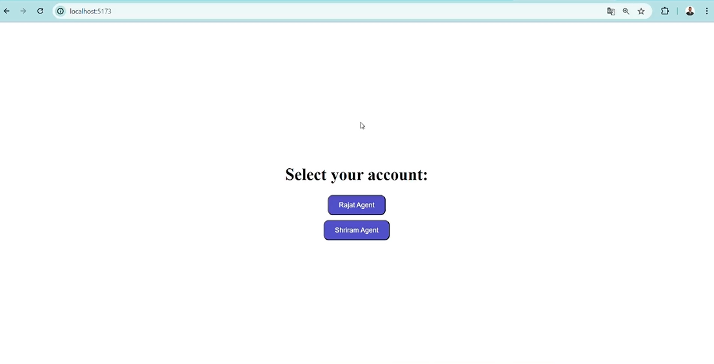
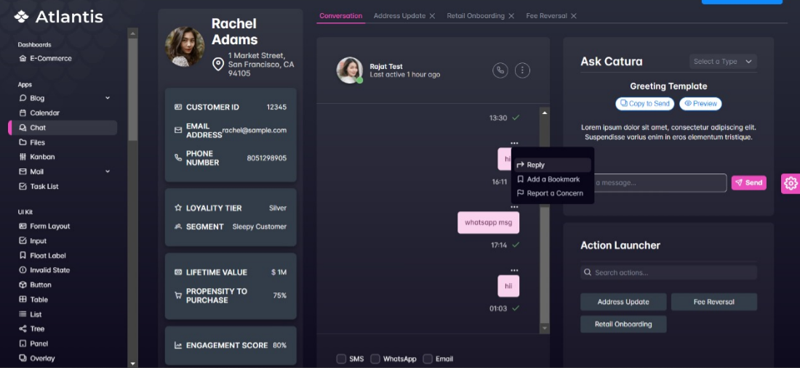
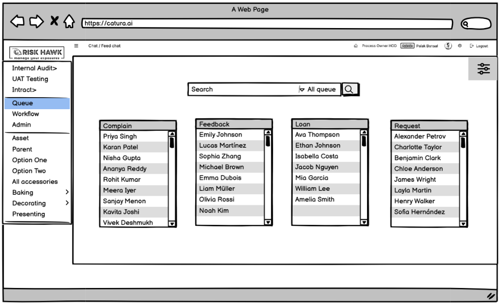

# Task Instructions for New Candidates

**IMPORTANT:** Please do not attempt this task if you do not have any knowledge of Socket.io or if you are unfamiliar with it, as it will be required in future work.

## Task Overview

We request you to create two pages using the **Angular framework**.

### Page 1: Employee List

- This page should display a list of 3-4 dummy employees, as shown in the provided image below:

### Page 2: Sidebar and Queue Management

- This page should include a retractable sidebar with multiple options.
- One of the sidebar options should be **Queue**.
- The **Queue** page should display multiple lists with topics like **Employees List**, **Feedback List**, **Complain List**, etc., using the provided API to fetch the users.
- For colors to use like for UI idea you can use this page's colors , font as base line for your work show in image:

- Add a button to update the queue's casual name, following the design shown in the image below:

## Timeframe

We expect that you can complete this task within **48 hours (2 days)**.

## Submission

1. Upload your code to a **GitHub repository**.
2. Add **screenshots** of your work in the `README.md` file to help us review it.
3. Once done, **send us the link** to your GitHub repository and ping us that you have completed the task.

## API Documentation

You will be using two APIs for this task, which can be accessed through the Swagger documentation here: [Swagger API Docs](https://chatintract.azurewebsites.net/api-docs/#/) "https://chatintract.azurewebsites.net/api-docs/#/".

- **Get all people in a queue**:
  - Endpoint: `https://chatintract.azurewebsites.net/api/dummy/getAllPeopleInQueue?queue_name=Employees`
- **Update queue alias name**:
  - Endpoint: `https://chatintract.azurewebsites.net/api/dummy/updateQueueAlias`

If you are familiar with Swagger, it should be straightforward to understand the request structure and other details.

Good luck!
